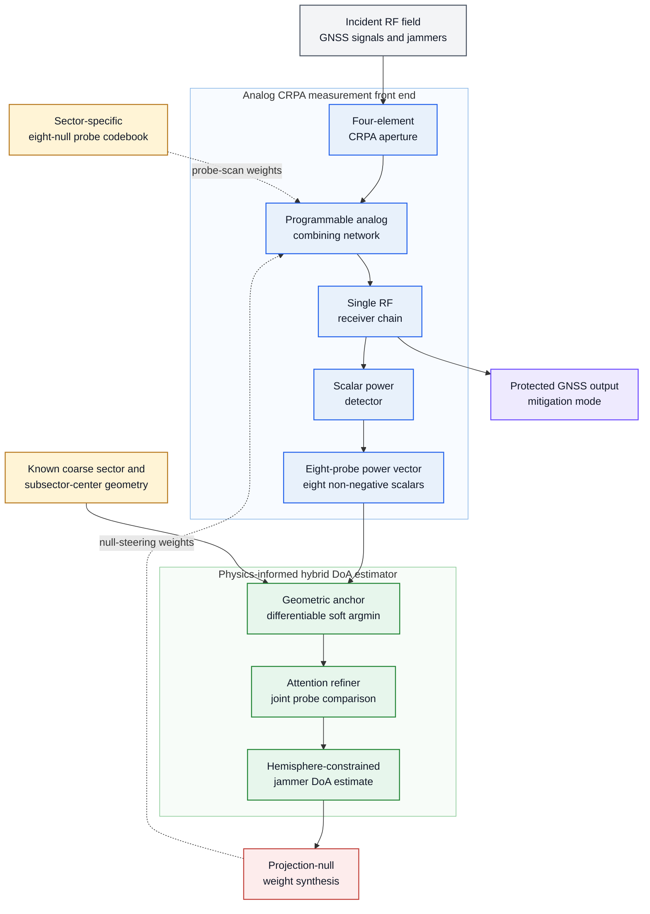

# Deep Analog Null Steering

**Real-Time DoA Estimation for GNSS Multi-Jammer Mitigation on SWaP-Constrained Analog CRPAs**  
Mazen Elaraby

This repository accompanies research on direction-of-arrival (DoA) estimation and jammer suppression for a four-element **analog** controlled-reception-pattern antenna (CRPA). Unlike a digital array, the front end has one RF receiver chain and exposes only eight non-negative scalar power readings per sector query: there are no per-element channels, phase measurements, I/Q samples, snapshots, or directly observed spatial covariance matrix.

The proposed estimator maps those eight powers and the known coarse sector directly to an upper-hemisphere direction. Its 52,575-parameter hybrid architecture combines a physically motivated geometric anchor with a compact attention refiner. On the archived single-jammer evaluation set it attains a **3.717° median great-circle error** and **7.072° RMSE**. Projection nulling from its predicted directions provides a **27.71 dB median jammer suppression ratio (JSR)**, with **89.3%** of evaluated scenes at or above 20 dB.

> **Scope.** The coarse sector index and jammer count are inputs to the evaluated system. Sector acquisition and jammer-count estimation are not implemented here. The array patterns are full-wave simulations rather than measurements from fabricated hardware.

## Contents

- [Physical system](#physical-system)
- [Theoretical foundations](#theoretical-foundations)
- [Measurement and dataset model](#measurement-and-dataset-model)
- [Estimator architecture](#estimator-architecture)
- [Training](#training)
- [Benchmark results](#benchmark-results)
- [Installation](#installation)
- [Reproducibility guide](#reproducibility-guide)
- [Implementation notes and limitations](#implementation-notes-and-limitations)
- [Manuscript](#manuscript)
- [Citation](#citation)

## Physical system

| Property | Value |
|---|---:|
| Elements | 4 |
| Geometry | Corners of a 6 cm square in the $z=0$ plane |
| Circumradius | 42.4 mm = $0.224\lambda$ at 1580 MHz |
| Design frequency | 1580 MHz |
| Receiver chains | 1 |
| Coarse sectors | 8: four azimuth quadrants × two elevation bands |
| Elevation split | 60° (equal solid angle) |
| Subsectors per sector | 8 |
| Probe readings per query | 8 scalar powers |
| Noise power | -114 dBm per element |
| JNR range | 20–50 dB |

The effective steering vector uses a distinct complex full-wave pattern for every element,

$$
\mathbf u(\theta,\phi)
= \left[E_n(\theta,\phi)
   e^{j\mathbf k(\theta,\phi)^T\mathbf r_n}\right]_{n=1}^{4}.
$$

The supplied 1580 MHz pattern CSVs are interpolated onto a 1° grid by `evaluation/crpa_physics.py`. The additional 1230 MHz files are included as reference data but are not used by the reported experiments.

### Nulling-probe convention

The v2 generator uses the **design-intent null codebook** from `data/sector_data_8sect.mat`. A row weight is applied using the ordinary transpose,

$$
s_m=\mathbf w_m^T\mathbf u,
$$

not $\mathbf w_m^H\mathbf u$. Conjugating the weight relocates the null. Because each v2 probe places a notch at its own subsector center, the informative reading is the **minimum**, not the maximum. Dataset validation reports:

- median on-center dip: **90.49 dB**;
- exact occupied-subsector recovery by raw `argmin`: **70.0%**, versus 12.5% chance;
- recovery among the two deepest probes: **94.5%**, versus 25% chance.

These values come from `data/VALIDATION_v2.txt`. The trained anchor independently learns the same inverted readout: for one-jammer queries, the median correlation between probe log-power and anchor weight is **-0.691**, and 96.5% of correlations are negative (`evaluation_results/PHASE5_V2.txt`).

## Theoretical foundations

### A 16-real-dimensional observability ceiling

For mutually incoherent jammers,

$$
\mathbf R = \sum_{j=1}^{J}P_j\mathbf u_j\mathbf u_j^H
            +\sigma_n^2\mathbf I_4.
$$

The mean power from probe $m$ can be written as

$$
\bar p_m
=\mathbf v_m^H\mathbf R\mathbf v_m
=\left\langle\mathbf R,\mathbf v_m\mathbf v_m^H\right\rangle,
\qquad \mathbf v_m=\overline{\mathbf w_m}.
$$

Every probe is therefore a linear functional of a $4\times4$ Hermitian matrix. Such a matrix has at most

$$
\dim_{\mathbb R}(\mathbf R)=N^2=16
$$

real degrees of freedom. Adding probes can improve averaging and conditioning, but cannot create a seventeenth observable covariance dimension.

A scene with $J$ incoherent jammers has two angles and one power per jammer, plus the noise level: $3J+1$ real unknowns. A necessary dimensional condition for joint identifiability is consequently

$$
3J+1\le16 \quad\Longrightarrow\quad J\le5.
$$

This is an algebraic ceiling, not a claim that five jammers are practically resolvable on this aperture. The measured conditioning is already poor at $J=3$.

### Why full-wave pattern diversity matters

If all four elements are assigned one common isotropic pattern, the accessible covariance structure collapses to nine real dimensions, giving the stricter count $3J+1\le9$, or $J\le2$. The four distinct mounted-element patterns break this idealized degeneracy and restore the 16-dimensional count. Pattern diversity is therefore part of the information model, not a cosmetic simulation detail.

### Fisher bound and conditioning

The implementation uses the parameter vector

$$
\boldsymbol\eta=
[\theta_1,\phi_1,\ln P_1,\ldots,\theta_J,\phi_J,\ln P_J,
\ln\sigma_n^2]^T
$$

and marginalizes unknown powers, noise level, and other jammer directions through a Schur complement. The angular bound is converted to the spherical arc metric with the required $\sin^2\theta$ factor on azimuth variance.

The repository reports the diagonally scaled condition number

$$
\kappa_{\mathrm{corr}}=
\kappa\!\left(\mathbf D^{-1/2}\mathbf F\mathbf D^{-1/2}\right),
\qquad \mathbf D=\operatorname{diag}(\mathbf F),
$$

rather than the raw FIM condition number. The raw value is dominated by parameter units—especially the noise-floor nuisance column—and is not a useful geometry metric.

### Why apparent sub-CRB behavior is not superefficiency

The Cramér–Rao bound used here is an unbiased-estimator bound, while the network is measurably biased. On informative geometries the network RMSE is **1.93×** the RMS bound. On the ill-conditioned half it is **0.70×**, but the fixed-DoA experiment shows why: the estimator retreats toward its geometric anchor as information collapses.

Across 1,008 fixed directions, bias grows from 1.217° to 5.470° between conditioning halves (**4.5×**), while random scatter changes only from 1.540° to 1.642°. The sub-bound cells are prior-dominated, not examples of beating the CRB. This repository makes no claim of CRB violation.

## Measurement and dataset model

The observed probe power is

$$
p_m=\bar p_m\left(1+\frac{\zeta_m}{\sqrt K}\right)+\varepsilon_m,
\qquad \zeta_m\sim\mathcal N(0,1),
$$

$$
\varepsilon_m\sim\mathcal N\!\left(0,\alpha\bar p^2\right),
\qquad
\bar p=\frac{1}{8}\sum_{m=1}^{8}\bar p_m,
$$

with $K=10^6$ and $\alpha=10^{-3.5}=3.162\times10^{-4}$. Readings are floored at $10^{-6}\bar p$ to model a non-negative detector and keep logarithmic preprocessing finite.

The snapshot term cannot be discarded merely because $K\alpha\gg1$; its ratio to the detector variance is

$$
\frac{1}{K\alpha}\left(\frac{\bar p_m}{\bar p}\right)^2,
$$

so probe dynamic range matters. The archived verification finds a worst-probe ratio of 0.027 at $K=10^6$. A complete eight-probe scan corresponds to about 0.40 s at an illustrative 20 MHz sampling rate; inference is small compared with acquisition latency.

### Scene sampling

- jammer count composition is fixed per generated split and then shuffled;
- jammer sectors are drawn without replacement;
- elevation is uniform in solid angle within its sector band;
- azimuth is uniform within its sector interval;
- JNR is uniform on 20–50 dB;
- jammers are mutually incoherent;
- one query is issued per active jammer using that jammer's sector codebook;
- every query sees the covariance contribution of **all** jammers.

The default generator creates:

| File | Default scenes | Composition |
|---|---:|---|
| `data/dataset_v2_train.npz` | 320,000 | 50% 1J, 50% 2J |
| `data/dataset_v2_3j.npz` | 40,000 | 3J only |
| `data/dataset_v2_eval.npz` | 30,000 | equal thirds of 1J, 2J, and 3J |

`data/grid_2j_djnr_sep.npz` is a separate 18,000-scene, cell-targeted grid shared by the Phase 3.5 and Phase 4 heatmaps. Headline statistics remain evaluation-distribution statistics; the targeted grid is used only to prevent sparse heatmaps from being mistaken for physically unreachable regions.

## Estimator architecture

The end-to-end system is shown below at the functional level. A sector-specific
scan applies eight nulling probes through the programmable analog combiner, and
the single receiver chain records one scalar power per probe. The hybrid
estimator maps this power vector and the supplied sector geometry to a physically
valid upper-hemisphere DoA. Projection-null synthesis then converts the estimated
jammer directions into analog combining weights for mitigation.



### Exact modules

| Component | Implementation |
|---|---|
| Anchor weights | `LayerNorm(8) → Linear(8,32) → ReLU → Linear(32,8) → Softmax` |
| Hull release | `Linear(8,32) → ReLU → Linear(32,4)`; final layer zero-initialized |
| Anchor projection | `Linear(4,64) → ReLU → LayerNorm(64)` |
| Probe token embedder | `Linear(1,32) → ReLU → LayerNorm(32) → Linear(32,64) → ReLU → LayerNorm(64)` |
| Probe identity | `Embedding(64,64)` |
| Scale token embedder | Same 1→32→64 stack as a probe token |
| Sequence | 10 tokens: CLS, scale, and 8 probes; width 64 |
| Attention | One `MultiheadAttention(64, num_heads=4, batch_first=True)` |
| Attention output | Residual addition and `LayerNorm(64)`; no stacked encoder or FFN block |
| Correction head | `Linear(129,128) → ReLU → LayerNorm(128) → Linear(128,64) → ReLU → LayerNorm(64) → Linear(64,3)` |
| Output | `[cos θ, sin θ, cos φ, sin φ]` |
| Trainable parameters | **52,575** |

### Geometric anchor

The anchor forms a convex combination of the eight center encodings

$$
\mathbf g_0=\sum_{m=1}^{8}a_m
[\cos\theta_m,\sin\theta_m,\cos\phi_m,\sin\phi_m]^T.
$$

The learned offset permits departure from this convex hull and is zero-initialized so training begins at the pure geometric anchor. Phase 5 shows that the hull-only anchor already reaches 10.120° median error; the offset changes this to 9.726°, while the full refiner reaches 3.717°. The offset removes a structural restriction but is nearly neutral in measured accuracy.

### Attention refiner

Each probe token combines its normalized scalar power with a learned global subsector-ID embedding. A learned CLS token collects the readout. An absolute-scale token is also present, but the archived attention diagnostic finds zero CLS-to-scale attention in all four heads. Absolute scale reaches the output through the direct scalar concatenation into the correction head, not through attention. The measured Fisher information is flat in common absolute JNR, so this inert attention path is unsurprising.

The attention heads have only 0.000–0.001 nats of measured entropy (uniform over ten tokens would be 2.303 nats). They behave more like learned selectors than broad distributed attention. Mean attention rows should therefore not be interpreted without their entropy.

### Upper hemisphere by construction

Elevation is corrected in the logit of $\cos\theta$:

$$
\cos\hat\theta=
\sigma\!\left(\operatorname{logit}(\cos\theta_g)+\Delta_\theta\right),
$$

which guarantees $0<\hat\theta<90^\circ$. Azimuth is represented and corrected on the unit circle. There is no post-hoc folding or clipping of predicted angles in the model; a small internal clamp protects the anchor value before applying `logit`, and the presentation decoder maps `atan2` to $[0,360^\circ)$.

## Training

`training/train_v2.py` expands every scene into one example per active jammer. Query $q$ uses that jammer's sector probe vector as input and its DoA as supervision, while the power vector includes leakage from all other jammers.

Preprocessing is

```text
norm_p    = log10(p + 1e-20) - log10(sum(p + 1e-20))
log_scale = log10(sum(p + 1e-20) / noise_power)
sub_ids   = sector_index * 8 + [0, ..., 7]
target    = [cos(theta), sin(theta), cos(phi), sin(phi)]
```

The split is performed by original **scene**, not by expanded query, preventing two queries from the same multi-jammer scene from crossing train/validation/test boundaries.

| Setting | Default |
|---|---:|
| Loss | Mean squared error on the four trigonometric outputs |
| Optimizer | AdamW |
| Learning rate | $10^{-2}$ |
| Weight decay | $10^{-4}$ |
| Scheduler | ExponentialLR, $\gamma=0.87$ |
| Optional scheduler | ReduceLROnPlateau, patience 2, factor 0.5 |
| Epochs | 50 |
| Batch size | 256 |
| Split | 80% train / 10% validation / 10% test by scene |
| Batching | Device-resident tensors with shuffled index slices; no `DataLoader` |
| Checkpoint criterion | Lowest validation MSE |

The archived run used an RTX 3060 Laptop GPU, took 22.8 minutes for 50 epochs, and selected the epoch-50 checkpoint with validation loss 0.022601. Its aggregate held-out training-split result mixes 1J and 2J queries and should not replace the phase-specific evaluation tables below.

## Benchmark results

All values below are transcribed from files under `evaluation_results/`, plus `evaluation/CRLB_V2_VERIFICATION.txt` and `data/VALIDATION_v2.txt`. They are not reconstructed from manuscript prose.

### Single jammer

| Metric | Value | Evaluation population |
|---|---:|---:|
| Great-circle error, median | **3.717°** | 10,000 scenes |
| Great-circle error, P90 | **12.843°** | 10,000 scenes |
| Great-circle error, RMSE | **7.072°** | 10,000 scenes |
| Zenith error, median / P90 | 3.140° / 11.478° | 10,000 scenes |
| Azimuth error, median / P90 | 2.163° / 6.462° | 10,000 scenes |
| JSR, median | **27.71 dB** | 4,000 scenes |
| JSR, P10 / P90 | 19.77 / 37.71 dB | 4,000 scenes |
| $P(\mathrm{JSR}\ge10\,\mathrm{dB})$ | 98.6% | 4,000 scenes |
| $P(\mathrm{JSR}\ge20\,\mathrm{dB})$ | **89.3%** | 4,000 scenes |
| $P(\mathrm{JSR}\ge30\,\mathrm{dB})$ | 37.3% | 4,000 scenes |

The broad null from a $0.224\lambda$ aperture tolerates several degrees of DoA error: median JSR is 34.24 dB for errors no larger than 1°, and 28.21 dB for errors no larger than 5°.

### Scaling with jammer count

Errors are reported per jammer. Each scene uses one eight-probe query per jammer, and multi-jammer predictions are evaluated both directly and with Hungarian matching where set recovery is the question.

| $J$ | Parameters $3J+1$ | Probe readings | $\kappa_{\mathrm{corr}}$, median | Arc CRLB, median | Error P50 | Error P90 | Error RMSE |
|---:|---:|---:|---:|---:|---:|---:|---:|
| 1 | 4 | 8 | $2.450\times10^3$ | 5.793° | 3.72° | 12.84° | 7.072° |
| 2 | 7 | 16 | $1.705\times10^4$ | 28.918° | 11.86° | 29.49° | 18.015° |
| 3 | 10 | 24 | $1.089\times10^5$ | 49.969° | 15.26° | 34.27° | 21.348° |

From one to three jammers, scaled FIM conditioning degrades **44.4×** and the median bound grows **8.63×**, while network RMSE grows **3.02×**. The smaller error growth is not increasing efficiency: it is the biased estimator falling back toward its sector prior as the measurement becomes uninformative.

For three jammers, all three estimates satisfy the $\Delta_{\min}/3$ resolution criterion in 14.0% of scenes. Joint nulling over 2,000 scenes provides 7.93 dB median JSR and 9.91 dB mean JSR. Three nulls also consume three of a four-element array's spatial degrees of freedom, so this is a feasibility result rather than a recommended operating point.

### Two-jammer resolvability

A pair is counted as resolved when both Hungarian-matched estimates lie within one third of the true pair separation $\Delta$. Across 10,000 scenes:

- overall resolution: **62.1%**;
- query/truth swaps: **0.2%**;
- median error/separation: **0.155**; exact midpoint collapse would be 0.5;
- 50% resolution crossing: approximately **68°**.

| True separation | Scenes | Resolved |
|---:|---:|---:|
| 5–10° | 24 | 0.0% |
| 15–20° | 91 | 9.9% |
| 35–40° | 340 | 21.2% |
| 55–60° | 520 | 44.6% |
| 65–70° | 536 | 52.2% |
| 75–80° | 524 | 65.1% |
| 85–90° | 504 | 77.4% |

| Power-disparity subset | Scenes | Resolved |
|---|---:|---:|
| $\lvert\Delta\mathrm{JNR}\rvert\le5$ dB | 3,073 | 65.1% |
| $\lvert\Delta\mathrm{JNR}\rvert>15$ dB | 2,560 | 57.4% |

Separation is the stronger determinant of pair resolution. Power disparity remains important operationally because the weak target is localized and nulled much less accurately.

### Two-jammer dynamic range

For signed $\Delta\mathrm{JNR}=\mathrm{JNR}_{\mathrm{target}}-\mathrm{JNR}_{\mathrm{interferer}}$:

| Target-minus-interferer JNR | P50 error | RMSE | P90 error |
|---:|---:|---:|---:|
| -30 to -20 dB | 21.10° | 26.23° | 40.95° |
| -20 to -10 dB | 20.85° | 25.41° | 38.49° |
| -10 to -5 dB | 17.86° | 22.22° | 33.70° |
| -5 to +5 dB | 12.56° | 17.12° | 26.52° |
| +5 to +10 dB | 7.45° | 10.43° | 15.89° |
| +10 to +20 dB | 4.95° | 7.98° | 13.32° |
| +20 to +30 dB | 4.26° | 7.35° | 12.96° |

Targets at least 10 dB weaker have 25.62° RMSE, versus 7.82° for targets at least 10 dB stronger—a **3.28×** asymmetry. Beyond about -15 dB the weak-target error saturates near 26.2° instead of following the diverging unbiased weak-source bound. This is graceful prior fallback, not successful weak-target localization.

### Fixed-DoA bias/variance decomposition

The fixed-direction experiment uses 21 zenith rings × 48 azimuth spokes = **1,008 directions**, with 96 independent measurements at each direction and JNR fixed at 35 dB: 96,768 queries total.

| Quantity | All directions | Well-conditioned half | Ill-conditioned half |
|---|---:|---:|---:|
| Median $\lvert\mathrm{bias}\rvert$ | 1.994° | 1.217° | 5.470° |
| Median scatter | 1.575° | 1.540° | 1.642° |
| RMSE | — | 3.812° | 7.775° |
| Median bias fraction | 0.645 | 0.415 | 0.894 |
| RMSE / RMS CRLB | — | 3.19 | 0.68 |

Of 1,008 directions, 268 have RMSE below their own unbiased bound. Their median bias fraction is 0.884, versus 0.508 elsewhere. Bias points toward the sector center with magnitude-weighted mean cosine +0.536 and magnitude-weighted inward probability 83.6%, directly identifying the geometric anchor as the fallback mechanism.

## Installation

### Prerequisites

- Python **3.10+** (`float | None` type syntax is used);
- approximately 1 GB free RAM beyond the Python environment for routine evaluation; training loads the expanded dataset onto the selected device;
- CUDA is optional but recommended for full training;
- MATLAB is optional and needed only for the geometry-only scripts under `dsp/`;
- a TeX distribution containing IEEEtran and BibTeX is needed to rebuild the manuscript.

The archived run used Python 3.10.7, PyTorch 2.6.0+cu124, NumPy 2.2.6, SciPy 1.15.3, and Matplotlib 3.10.8. `requirements.txt` specifies compatible minimum versions rather than claiming these exact versions are necessary.

### Create an environment

Windows PowerShell:

```powershell
python -m venv .venv
.\.venv\Scripts\Activate.ps1
python -m pip install --upgrade pip
python -m pip install -r requirements.txt
```

Linux/macOS:

```bash
python3 -m venv .venv
source .venv/bin/activate
python -m pip install --upgrade pip
python -m pip install -r requirements.txt
```

For a CUDA build, install the PyTorch wheel recommended for the host driver from the [official PyTorch selector](https://pytorch.org/get-started/locally/) before installing the remaining requirements. CPU execution is supported.

### Preflight checks

Run from the repository root:

```bash
python evaluation/crpa_physics.py
python evaluation/verify_architectural_invariances_v2.py
python evaluation/verify_v2_changes.py checkpoints/best_model_v2.pth
```

The physics self-test should report a `(4, 181, 361)` pattern grid and `(8, 8, 4)` codebook. Two legacy comparisons are skipped because the optional `data/compatible_dataset_eval.mat` is not shipped; this does not affect the v2 pipeline.

## Reproducibility guide

All commands below assume the repository root as the working directory. Evaluation scripts use the shipped `checkpoints/best_model_v2.pth` and `data/dataset_v2_eval.npz` unless their source defaults are changed.

> **Artifact safety:** phase scripts mirror stdout into their corresponding files under `evaluation_results/` and therefore overwrite archived text artifacts. Copy `evaluation_results/` before rerunning if the original paper outputs must be preserved.

### 1. Generate datasets

Full paper-sized generation:

```bash
python dataset_generation/generate_dataset_v2.py \
  --out-dir data \
  --n-train 320000 \
  --n-3j 40000 \
  --n-eval 30000 \
  --alpha 0.00031622776601683794 \
  --snapshots 1000000 \
  --seed 20260920
```

Windows `cmd.exe` equivalent:

```cmd
python dataset_generation\generate_dataset_v2.py --out-dir data --n-train 320000 --n-3j 40000 --n-eval 30000 --alpha 0.00031622776601683794 --snapshots 1000000 --seed 20260920
```

The command overwrites same-named `.npz` files. For a non-destructive smoke run, use a separate directory:

```bash
python dataset_generation/generate_dataset_v2.py --out-dir smoke_data --n-train 1000 --n-3j 300 --n-eval 300
python dataset_generation/validate_dataset_v2.py --data smoke_data/dataset_v2_eval.npz
```

Validate the shipped evaluation data:

```bash
python dataset_generation/validate_dataset_v2.py --data data/dataset_v2_eval.npz
```

### 2. Train the model

Reproduce the default training recipe without overwriting the paper checkpoint:

```bash
python training/train_v2.py \
  --data data/dataset_v2_train.npz \
  --out checkpoints/reproduction \
  --tag reproduction \
  --epochs 50 \
  --batch-size 256 \
  --lr 0.01 \
  --weight-decay 0.0001 \
  --gamma 0.87 \
  --scheduler exp \
  --device auto
```

Quick CPU smoke training:

```bash
python training/train_v2.py --limit 4096 --epochs 2 --device cpu --out checkpoints/smoke_reproduction --tag smoke_reproduction
```

The paper checkpoint is `checkpoints/best_model_v2.pth`. The default evaluation scripts are intentionally tied to that checkpoint; using a reproduction checkpoint requires passing it to `evaluation/eval_v2_quick.py` or changing `DEFAULT_CKPT` in `evaluation/v2_common.py`.

### 3. Quick inference readout

```bash
python evaluation/eval_v2_quick.py
python evaluation/eval_v2_quick.py checkpoints/reproduction/best_model_reproduction.pth
```

This prints per-jammer-count errors and does not generate figures.

### 4. Verify the power-only CRLB

```bash
python evaluation/crlb_v2.py
```

This runs detector/snapshot variance checks, the covariance-sensitivity comparison, 800-trial Monte Carlo fits at 20/35/50 dB, the JNR-flatness check, and the weak-jammer slope experiment. The archived output is `evaluation/CRLB_V2_VERIFICATION.txt`; the script itself prints to stdout, so redirect explicitly if a new log is required.

### 5. Reproduce evaluation phases and figures

Run in this order so Phase 4 can reuse the Phase 3.5 scene cache:

```bash
# Phase 1: 1J accuracy, CDF, spatial map, JNR/CRLB analysis
python evaluation/evaluate_phase1_v2.py

# Fixed-DoA bias/variance decomposition
python evaluation/evaluate_bias_variance_v2.py

# Phase 2: two-jammer resolution
python evaluation/evaluate_phase2_v2.py

# Phase 3.5: signed dynamic range and targeted heatmap grid
python evaluation/evaluate_phase3_5_v2.py

# Multi-jammer headline results and conditioning-vs-DoF
python evaluation/evaluate_3j_basic.py
python evaluation/evaluate_conditioning_vs_dof.py

# Phase 4: one- and two-jammer projection-nulling JSR
python evaluation/evaluate_phase4_v2.py

# Phase 5: attention, soft-argmin, and stage decomposition
python evaluation/visualize_attention_v2.py

# Architecture invariance/mechanism checks
python evaluation/verify_architectural_invariances_v2.py
python evaluation/verify_v2_changes.py checkpoints/best_model_v2.pth
```

Outputs are written to:

| Script | Numerical artifact | Figure directory |
|---|---|---|
| `evaluate_phase1_v2.py` | `evaluation_results/PHASE1_V2.txt` | `figures/phase1/` |
| `evaluate_bias_variance_v2.py` | `evaluation_results/PHASE1_BIAS_VARIANCE_V2.txt` | `figures/phase1/` |
| `evaluate_phase2_v2.py` | `evaluation_results/PHASE2_V2.txt` | `figures/phase2/` |
| `evaluate_phase3_5_v2.py` | `evaluation_results/PHASE3_5_V2.txt` | `figures/phase3.5/` |
| `evaluate_3j_basic.py` | `evaluation_results/PHASE3J_V2.txt` | `figures/phase3j/` |
| `evaluate_conditioning_vs_dof.py` | `evaluation_results/CONDITIONING_VS_DOF.txt` | `figures/phase3j/` |
| `evaluate_phase4_v2.py` | `evaluation_results/PHASE4_V2.txt` | `figures/phase4/` |
| `visualize_attention_v2.py` | `evaluation_results/PHASE5_V2.txt` | `figures/phase5/` |
| `verify_architectural_invariances_v2.py` | print output; archived as `INVARIANCES_V2.txt` | — |

### 6. Synchronize manuscript figures

The evaluation scripts write source artifacts under `evaluation_results/figures/`; the manuscript uses selected flat copies under `manuscript/figures/`. On Windows PowerShell:

```powershell
$files = @(
  'phase1\phase1_bias_variance.pdf',
  'phase1\phase1_error_cdf.pdf',
  'phase1\phase1_jnr_efficiency.pdf',
  'phase1\phase1_spatial_map.pdf',
  'phase2\phase2_resolution.pdf',
  'phase3.5\phase3_5_dynamic_range.pdf',
  'phase3.5\phase3_5_error_heatmap.pdf',
  'phase3j\phase3j_conditioning_vs_dof.pdf',
  'phase3j\phase3j_summary.pdf',
  'phase4\phase4_2_jsr_heatmap.pdf',
  'phase4\phase4_jsr_vs_error.pdf',
  'phase5\phase5_decomposition.pdf'
)
$files | ForEach-Object {
  Copy-Item (Join-Path 'evaluation_results\figures' $_) 'manuscript\figures' -Force
}
```

Measured manuscript values are bound manually in `manuscript/macros.tex`; evaluation scripts do not rewrite that file.

## Implementation notes and limitations

1. **Known sector and jammer count.** Every reported query is conditioned on the correct coarse sector and fixed $J$. Acquisition/model-order selection remain future work.
2. **Dynamic range is the dominant failure mode.** A weak jammer more than roughly 15 dB below another falls back to sector-scale accuracy.
3. **Pattern model, not hardware validation.** Full-wave files include coupling and mounted-element diversity as simulated, but not manufacturing and calibration errors measured on hardware.
4. **One attention block.** The model is not a stacked Transformer encoder and has no attention FFN sublayer. A heteroscedastic uncertainty head is also not implemented.
5. **MATLAB geometry source is partial.** `dsp/sector_generation_gen.m` regenerates equal-solid-angle centers and edges but deliberately leaves `Subsectors.Weights` empty. The weighted codebook used by Python is the supplied `data/sector_data_8sect.mat`; a script that regenerates that weighted `.mat` file is not included.
6. **Optional legacy self-test absent.** `data/compatible_dataset_eval.mat` is not included. Only two historical re-simulation checks in `evaluation/crpa_physics.py` skip; v2 generation and evaluation do not require it.
7. **DSP README provenance.** `dsp/README.md` documents older MATLAB conventions in places. For the reported v2 pipeline, use the ordinary-transpose, design-intent convention documented here, in `dataset_generation/generate_dataset_v2.py`, and in the manuscript.

## Manuscript

The compiled paper is available at [`manuscript/main.pdf`](manuscript/main.pdf). Build it with:

```bash
cd manuscript
pdflatex main
bibtex main
pdflatex main
pdflatex main
```

The document uses IEEEtran and the packages declared at the top of `manuscript/main.tex`. `manuscript/macros.tex` is the single source for measured numerical values; `manuscript/references.bib` supplies the bibliography.

## Citation

No DOI or final publication venue is encoded in this workspace. Until one is assigned, cite the manuscript and accompanying code as:

```bibtex
@misc{elaraby2026deepanalog,
  author = {Elaraby, Mazen},
  title  = {Deep Analog Null Steering: Real-Time DoA Estimation for GNSS
            Multi-Jammer Mitigation on SWaP-Constrained Analog CRPAs},
  year   = {2026},
  note   = {Manuscript and accompanying research code}
}
```
